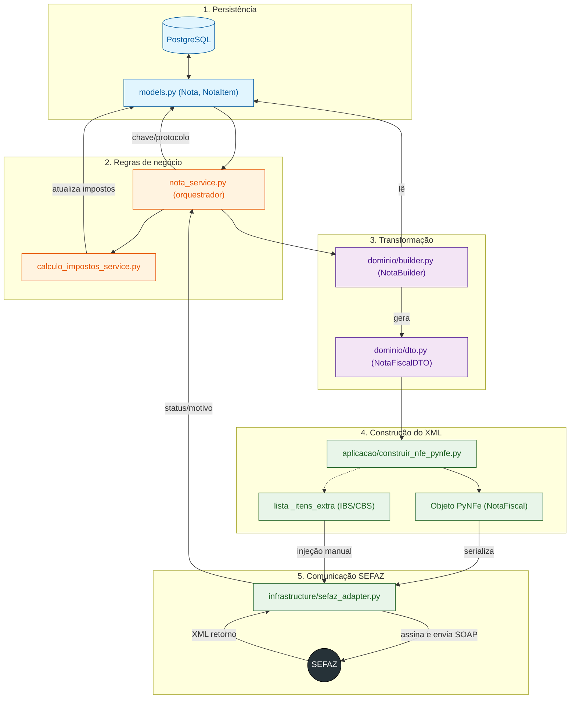

# Fluxo de Emissão de NF-e

> Caminho completo da emissão: modelos → cálculo → DTO → XML PyNFe → assinatura A1 → SEFAZ → retorno.

## Diagrama do fluxo

## Responsabilidade de cada arquivo

| Etapa | Arquivo | Função |
| --- | --- | --- |
| 1 | `Notas_Fiscais/models.py` | `Nota`, `NotaItem`, `NotaItemImposto` (inclui IBS/CBS) |
| 2 | `services/calculo_impostos_service.py` | Cálculo tributário pré-emissão; alíquotas IBS/CBS; regras defensivas (ex.: `cst_icms` nunca nulo) |
| 3 | `dominio/builder.py` | Padrão *Builder*: modelos Django → DTO plano. Desacopla emissão do esquema do banco |
| 3 | `dominio/dto.py` | `NotaFiscalDTO`: emitente, destinatário, itens, `valor_ibs`/`valor_cbs` etc. |
| 4 | `aplicacao/construir_nfe_pynfe.py` | DTO → objetos PyNFe. Campos IBS/CBS ficam na lista `_itens_extra` ("pegam carona" até a assinatura) |
| 5 | `infrastructure/sefaz_adapter.py` | Serializa o XML, **injeta manualmente** as tags `<IBS>`/`<CBS>` (só quando valores > 0 — evita erro 225), assina com certificado A1, transmite via SOAP e loga o retorno (diagnóstico de erros como 656/225) |
| 6 | `services/nota_service.py` | Orquestra tudo e atualiza o status da nota (autorizada/rejeitada/cancelada) |

## Pendências conhecidas

- Campos `id_csrt` e `hash_csrt` faltam no `ResponsavelTecnicoDTO` — obter dos dados da filial ou dos XMLs emitidos pelo Spartacus.

---

*Padronizado em 2026-09-01. Fonte: `Notas_Fiscais/ESTRUTURA_EMISSAO.md` (movido para docs).*
