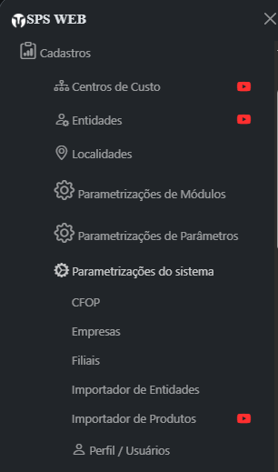
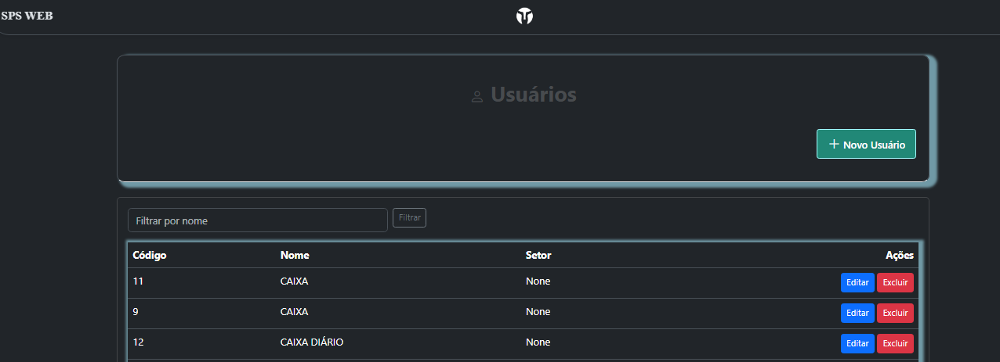
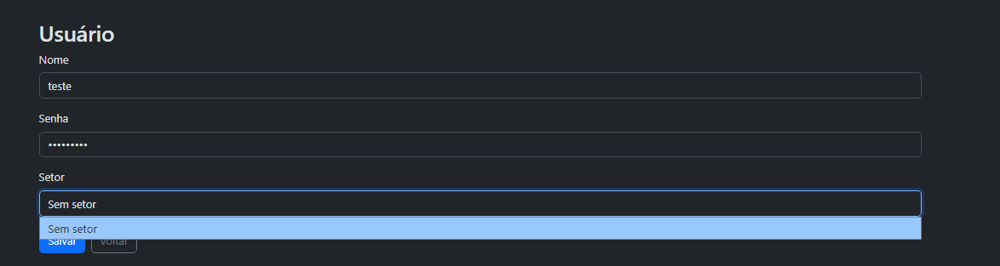
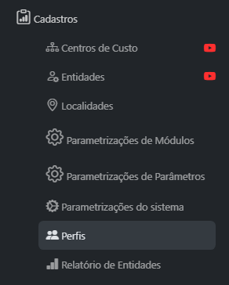
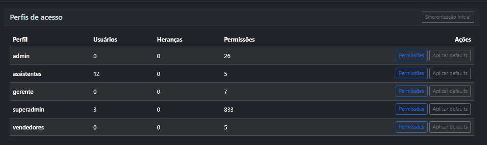
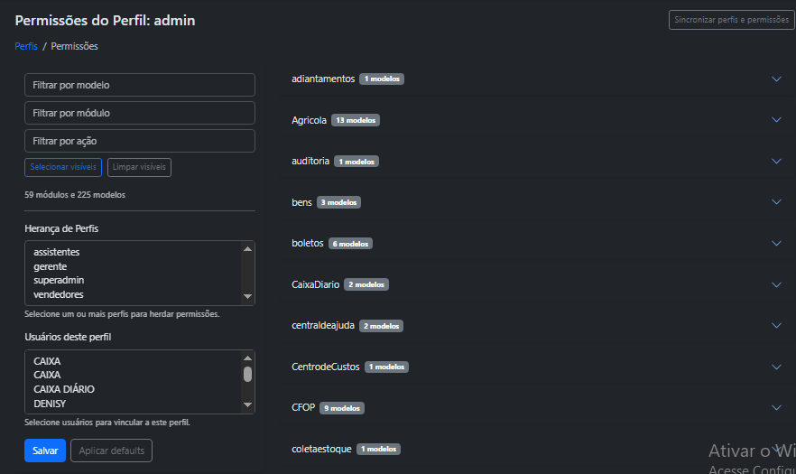

# Cadastro de Usuários e Perfis de Acesso

> Como criar usuários, definir setores e vincular perfis de permissão no SPS Mobile / SPS Web.

## 1. Cadastro de usuários

O cadastro de usuários é feito dentro do próprio sistema, na tela **Perfil / Usuários**.

**Caminho:** Cadastros → Parametrizações do sistema → Perfil / Usuários

> **Quem tem acesso:** o menu "Parametrizações do sistema" é limitado a usuários específicos, **independentemente do perfil de acesso** atribuído. A liberação é feita pelo **nome do usuário logado**, destinada aos administradores reais do sistema. A mesma restrição vale para as telas em si e para a API — não basta esconder o menu.
>
> **Usuários com acesso:** `admin`, `mobile`, `master`, `web` e `lais`.

### 1.1 Tela de usuários

Permite criar novos usuários e, para os existentes, filtrar por nome, editar e excluir.

### 1.2 Criando um novo usuário

Define-se o **nome**, a **senha** e, opcionalmente, o **setor**. O código do usuário é gerado automaticamente. A edição de um usuário existente segue o mesmo processo.

### 1.3 O campo Setor

O setor gravado no cadastro influencia diretamente o comportamento do sistema:

| Situação | Efeito |
| --- | --- |
| Setor **Administrador** (código 6) | Usuário tratado como administrador nas telas de parâmetros e enxerga as ordens de serviço de **todos** os setores |
| Usuário **sem setor** | No módulo de Ordem de Serviço, enxerga e movimenta **todas** as ordens (tratado como administrador do fluxo) — atenção ao deixar vazio |
| Licenças com setor obrigatório (ex.: `savexml144`, `saveweb144`) | Usuário sem setor **não consegue fazer login** |
| Fluxo entre setores | A movimentação de ordens segue o cadastro de workflow de setores; o usuário só movimenta ordens do seu setor ou de setores dos quais pode receber |

## 2. Perfis de acesso

Após criar o usuário, vincule-o a um **perfil de acesso**, que define o que ele pode listar, visualizar, criar, editar, excluir, exportar e imprimir em cada módulo.

**Caminho:** Cadastros → Perfis

> O item de menu "Perfis" passa pelo mesmo filtro por nome de usuário. A tela em si, porém, é controlada pelo próprio perfil: quem tiver um perfil com permissão sobre o recurso de perfis (ou o perfil superadmin) acessa pela URL direta, mesmo sem o atalho no menu.

### 2.1 Tela de perfis

Perfis padrão pré-definidos: **superadmin, admin, gerente, vendedores e assistentes**. A listagem mostra usuários vinculados, heranças e permissões de cada perfil.

- **Permissões:** abre a configuração do perfil (item 2.2).
- **Aplicar defaults:** restaura o conjunto padrão de permissões do perfil.
- **Sincronização inicial:** cria os perfis padrão caso não existam, sincroniza o superadmin com todos os recursos do sistema e vincula automaticamente os usuários sem perfil (`admin` e `mobile` → superadmin; demais → assistentes).

### 2.2 Configurando um perfil

- **Marcar permissões** por módulo e modelo (tela/recurso), com as ações listar, visualizar, criar, editar, excluir, exportar e imprimir. Filtros por modelo/módulo/ação ajudam a localizar; "Selecionar visíveis" e "Limpar visíveis" agilizam a marcação em massa.
- **Definir herança:** o perfil herda as permissões dos perfis selecionados como pais, além das próprias.
- **Vincular usuários** na lista "Usuários deste perfil" — é aqui que se define um usuário como administrador do sistema (vinculando-o ao superadmin).
- **Salvar** aplica permissões, heranças e vínculos de uma vez.

### 2.3 Regras importantes

- **superadmin**: acesso total **incondicional** — o sistema libera tudo independentemente das permissões marcadas.
- **admin**: perfil comum, sem tratamento especial; vale só o que estiver marcado (o padrão é restrito a alguns módulos).
- **Um perfil por usuário**: vincular a um perfil remove automaticamente o vínculo anterior.
- **Usuário sem perfil**: o sistema **não bloqueia** usuários sem perfil nas telas controladas por perfil — sempre vincule cada usuário a um perfil adequado.
- **Cache**: alterações de permissão podem levar alguns minutos para valer; feitas pela tela, o cache é limpo automaticamente.

## 3. Resumo do fluxo

1. Criar o usuário em Cadastros → Parametrizações do sistema → Perfil / Usuários (nome, senha e setor);
2. Conferir o setor conforme a função (lembrando os efeitos do setor Administrador e do usuário sem setor);
3. Vincular o usuário a um perfil em Cadastros → Perfis → Permissões;
4. Validar o acesso logando com o novo usuário.

---

*Padronizado em 2026-09-01. Fonte: documento "Cadastro de Usuários e Perfis — SPS Mobile" (docx). Imagens em `img/cadastro-usuarios-perfis/`.*
